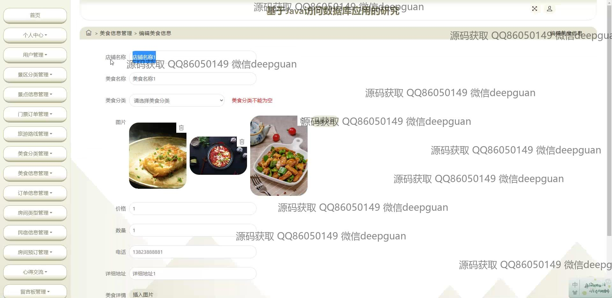

<h1 align="center">基于Java访问数据库应用的研究</h1>

## 简介
旅游信息管理系统：角色分为管理员、用户；功能包括用户管理、景区分类管理、订单管理、民宿信息编辑、旅游路线管理、美食信息发布和订单查询等。    --计算机毕业设计源码；毕设源码；java毕业设计源码

## 联系方式

<h3 align="center">获取完整代码与数据库文件 + 微信：deepguan QQ: 86050149 QQ群: 783742310</h3>

<h3 align="center">可帮忙远程部署 包运行成功！提供远程部署、修改代码、设计文档指导、代码讲解等服务！</h3>

## 功能介绍（完整见运行截图）
管理员：用户管理，编辑与删除功能接口，查看与更新用户资料。页面导航管理，包括景区分类、订单管理、轮播图片和房间管理。信息管理平台，包括民宿、美食、景点等信息的录入、修改和删除。订单处理与管理，查看和更新交易详细信息。景区与旅游路线分类管理，通过上传图片和输入文本更新分类。信息查询及数据管理工具，如批量删除和搜索功能。

用户：注册与登录访问系统基本功能，查看或编辑个人信息。浏览首页，借助导航栏访问景点信息、旅游路线、美食信息等模块。旅游资讯查阅，支持按分类查看民宿、景区、门票信息，包含搜索与详情预览。购物与预订系统，支持商品信息查看、价格查询、收藏与预订。评论与留言板互动功能，用于提交反馈与咨询，查看和管理个人评论。

## 运行截图

本代码来源于网络,仅供学习参考使用!

